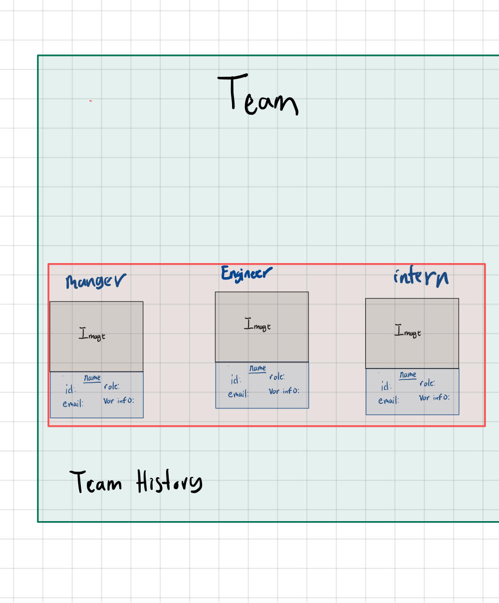

# gato365-team-profile-generator-redo

Generate Profile for team members

# Team Viewer

The primary purpose of this project hey Siri define the application that allows a user to enter teams information within the command line prompt using inquirer this  information is supposed to be stored with a class then displayed within an html file.

 My ideal html look like this:

 

Due to time, I thought it would be ideal for me to list what this project is missing and refactor the code throughout the quarter:

## How to use Command Line Interface

When implementing this application, the following steps must be taken
1.	Choose the appropriate team’s name

2.	Provide the manager's information (managers name, managers ID, managers e-mail, managers office number)

3.	From there, determine your next decision:  add engineer, add intern, is the team finish

4.	If you decide to add an engineer, provide the engineer’s information (name, ID, email, and GitHub username). You are then taken to the menu to be able to add engineer, add intern, is the team finish

5.	If you decide to add an intern, provide the intern’s information (name, ID, email, and school). You are then taken to the menu to be able to add engineer, add intern, is the team finish

6.	If you decide the team is finished, click that button, and the HTML will be generated.

## Potential Updates

### 1. Command Line Questions (FIXED)
Dynamically ask questions to the user regarding teams information in that after the manager’s information is given, the option to either answer questions about the intern or engineer or leave the application. If the user wants to answer questions regarding the engineer then afterwards the user is prompt either to answer questions about the intern or leave. If the user wants to answer questions about the intern after the manager, once done the program exits.

Had to use Switch Statements

### 2. Make another Class (Got it!!)
Create an input class that stores the user’s information so that it could be called within the index.js file.

### 3. Fixed Test functionality (Did this too :) ) 
Create tests to determine classes worked correctly.

### 4. Enhance HTML and CSS (Still an issue)
Make my html file prettier! I would also want to add the feature regarding emails for managers and allow the user to go to the engineers GitHub account.